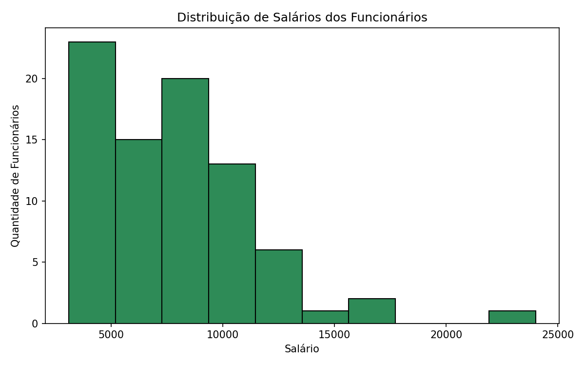
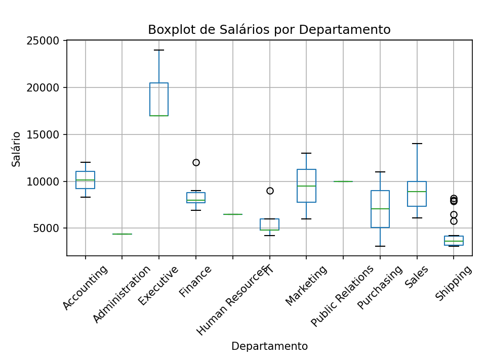
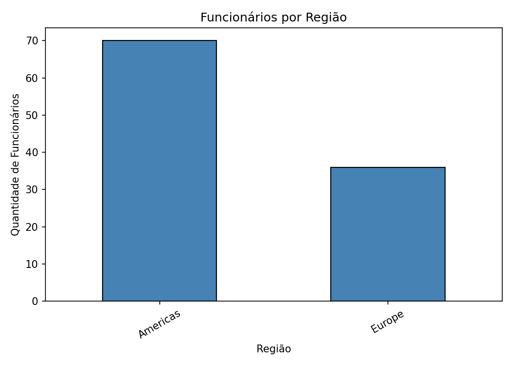

# Visualização de Dados e Business Intelligence — Análise de RH (FreeSQL)

## Aluno e Turma
- Nome: Luiz Fernando de Jesus Silva Homem
- Turma: Visualização de Dados - T2

## Objetivo do Trabalho
Analisar os dados de Recursos Humanos da empresa (esquema **HR** do banco **FreeSQL**),
identificando quais departamentos e cargos concentram os maiores salários e como os
funcionários estão distribuídos entre cidades, países e regiões. O projeto combina
consultas SQL com uma análise exploratória em Python (EDA).

## Tabelas Utilizadas
| Tabela | Descrição |
|---|---|
| `EMPLOYEES` | Dados dos funcionários (nome, salário, cargo, departamento, gestor) |
| `DEPARTMENTS` | Departamentos da empresa e seu local de funcionamento |
| `JOBS` | Cargos, com faixa salarial mínima e máxima |
| `LOCATIONS` | Endereços/cidades de cada local de trabalho |
| `COUNTRIES` | Países, vinculados a uma região |
| `REGIONS` | Regiões geográficas (Americas, Europe, Asia, etc.) |

## Resumo das Consultas SQL

### Query 1 — Comparação de Salários por Departamento e Cargo
Relaciona `EMPLOYEES` com `DEPARTMENTS` e `JOBS` (2 `LEFT JOIN`), filtrando com
`WHERE SALARY > 3000`, para observar quais cargos e departamentos concentram os
maiores salários. Arquivo: [`sql/query_01.sql`](sql/query_01.sql) → exportado para
[`dados/query_01.csv`](dados/query_01.csv).

### Query 2 — Distribuição dos Funcionários por Localidade
Relaciona `EMPLOYEES` com `DEPARTMENTS`, `LOCATIONS`, `COUNTRIES` e `REGIONS`
(4 `LEFT JOIN`, atendendo ao mínimo de 2 pedido), filtrando com
`WHERE REGION_NAME IS NOT NULL`, para mapear cidade/país/região de cada funcionário.
Arquivo: [`sql/query_02.sql`](sql/query_02.sql) → exportado para
[`dados/query_02.csv`](dados/query_02.csv).

## Análise em Python (EDA)
O script [`analise.py`](analise.py):
1. Lê os dois CSVs com `pandas`.
2. Calcula estatísticas descritivas dos salários: **média, mediana, mínimo, máximo e
   desvio padrão**.
3. Agrupa o salário médio por **departamento** e por **cargo**.
4. Conta a quantidade de funcionários por **região, país e cidade**.
5. Gera três gráficos, salvos em `graficos/`:
   - `histograma_salarios.png` — distribuição geral dos salários;
   - `boxplot_salarios_departamento.png` — comparação de salários entre departamentos
     (mostra outliers);
   - `funcionarios_por_regiao.png` — gráfico de barras complementar da distribuição
     geográfica.

## Principais Resultados Encontrados
*(calculados a partir dos dados reais extraídos do FreeSQL, esquema HR)*

- Salário médio geral: **≈ 7.696,49**, com mediana de **7.500,00** e desvio padrão de
  **≈ 3.725,87**. A média é puxada para cima por alguns salários bem mais altos
  (Presidente e Vice-Presidente), o que aparece no histograma como uma cauda longa à
  direita, e no boxplot como outliers acima do bigode superior em departamentos como
  Finance e Shipping.
- Salário mínimo: **3.100,00** (Purchasing Clerk) — salário máximo: **24.000,00**
  (President).
- Departamento com maior salário médio: **Executive** (≈ 19.333); menores médias:
  **Shipping** (≈ 4.313) e **Administration** (4.400).
- Cargos mais bem remunerados: **President** (24.000) e **Administration Vice
  President** (17.000); menos remunerados: **Purchasing Clerk** (3.100) e **Stock
  Clerk** (≈ 3.314).
- A empresa está concentrada em apenas duas regiões nesta base: **Americas** (70
  funcionários) e **Europe** (36 funcionários) — não há funcionários registrados em
  Asia ou Middle East/Africa neste conjunto de dados.
- As cidades com mais funcionários são **South San Francisco** (45), **Oxford** (34) e
  **Seattle** (18); a maioria dos funcionários está nos **Estados Unidos** (68) e no
  **Reino Unido** (35).

## Gráficos Gerados

**Distribuição de Salários (Histograma)**



**Salários por Departamento (Boxplot)**



**Funcionários por Região**



## Como Executar o Projeto
1. Clone o repositório.
2. (Opcional) Rode as queries de `sql/query_01.sql` e `sql/query_02.sql` diretamente no
   FreeSQL e exporte os resultados, substituindo os arquivos em `dados/`.
3. Instale as dependências:
   ```bash
   pip install pandas matplotlib
   ```
4. Execute a análise:
   ```bash
   python3 analise.py
   ```
5. Os gráficos serão salvos na pasta `graficos/` e as estatísticas serão impressas no
   terminal.

## Sobre os Dados Incluídos Neste Repositório
Os arquivos `dados/query_01.csv` e `dados/query_02.csv` deste repositório foram
extraídos **diretamente do FreeSQL**, executando as consultas de `sql/query_01.sql` e
`sql/query_02.sql` no esquema `HR` e exportando o resultado em formato CSV. São,
portanto, os dados reais utilizados na análise apresentada neste README.

## Sugestões de Melhoria para Futuras Versões
- Adicionar análise de correlação entre tempo de casa (`HIRE_DATE`) e salário.
- Incluir comparação entre o salário praticado e a faixa (`MIN_SALARY`/`MAX_SALARY`)
  definida em `JOBS`, para identificar funcionários fora da faixa esperada do cargo.
- Automatizar a conexão direta ao FreeSQL via Python (ex.: `sqlalchemy` + driver), em
  vez de exportação manual de CSV.
- Criar um dashboard interativo (ex.: Streamlit ou Power BI) para explorar os dados sem
  precisar reexecutar o script.

## Estrutura do Repositório
```
projeto_recuperacao/
├── sql/
│   ├── query_01.sql
│   └── query_02.sql
├── dados/
│   ├── query_01.csv
│   └── query_02.csv
├── graficos/
│   ├── histograma_salarios.png
│   ├── boxplot_salarios_departamento.png
│   └── funcionarios_por_regiao.png
├── analise.py
└── README.md
```
